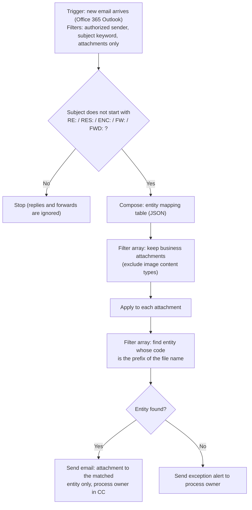

# Automated Credit Report Distribution for a Credit Union Network

**Microsoft Power Automate | Workflow Automation | Data Privacy by Design | Credit Risk Operations**

A low-code cloud flow that automatically routes recurring credit risk reports (stop-loss reports) to each member credit union of a cooperative financial network, ensuring that every institution receives **only its own report**, with exception alerting, loop protection and a full audit trail.

> All names, email addresses, entity codes and internal identifiers in this repository are fictional. No production data, credentials or tenant information are included.

---

## Business Problem

A central cooperative (the service entity of a credit union network) receives, from a corporate sender, a single email containing several credit risk reports. Each attachment belongs to a different member credit union, identified by a numeric code at the beginning of the file name.

Before this project, the process was fully manual:

- The analyst opened the email, identified each file and forwarded it, one by one, to the correct recipients of each credit union.
- Each credit union has multiple recipients (credit, collections and risk teams).
- The process was repetitive, time-consuming and exposed to **operational risk**: forwarding a report to the wrong institution would mean a **data privacy and banking secrecy incident**.

## Solution

An event-driven **Power Automate cloud flow** that:

1. Triggers automatically when the report email arrives from the authorized corporate sender.
2. Ignores replies and forwards (loop protection).
3. Discards non-business attachments (signature logos and inline images).
4. For each report, extracts the entity code from the file name and looks it up in a configuration table.
5. Sends each report **individually** to the matching credit union, with the process owner in CC as an audit trail.
6. Sends an **exception alert** to the process owner whenever a file cannot be matched to any entity.

## Architecture



## Business Rules

| # | Rule | Implementation |
|---|------|----------------|
| 1 | Only emails from the authorized corporate sender trigger the flow | Trigger `From` filter |
| 2 | Only emails with the report keyword in the subject and with attachments | Trigger `Subject Filter` and `Only with Attachments` |
| 3 | Replies and forwards must never trigger a new distribution | Condition on subject prefix (multilingual: EN and PT-BR) |
| 4 | Signature images are not business documents | Filter array on `contentType` |
| 5 | Each credit union receives only its own report | Per-attachment routing based on file name prefix |
| 6 | Unknown entity codes must be escalated, never dropped silently | Exception alert branch |
| 7 | Every distribution must leave evidence | Process owner in CC and flow run history |

## Key Design Decisions

- **Data segregation by design.** Recipients are resolved per attachment, never as a single distribution list. No institution can see another institution's report or contact list.
- **Configuration over code.** The entity-to-recipient mapping lives in a single JSON table. Adding a credit union or changing a contact requires no change to the flow logic.
- **Loop protection.** Outgoing emails use a forward prefix that the entry condition blocks, so the process owner's CC copy never re-triggers the flow.
- **Robust attachment filtering.** The `isInline` flag proved unreliable across Outlook clients (regular attachments were flagged as inline). Filtering by `contentType` (excluding `image/*`) solved it.
- **Fail loudly.** Any unmatched file generates an alert, so no report is ever left undelivered without the owner knowing.
- **Sensitivity labeling.** Outgoing messages carry the organization's internal classification label.

## Tech Stack

- Microsoft Power Automate (cloud flows, automated trigger)
- Office 365 Outlook connector (Exchange Online)
- Workflow Definition Language expressions (Azure Logic Apps engine)
- JSON configuration
- Microsoft 365 sensitivity labels

## Core Expressions

| Step | Expression |
|------|------------|
| Keep business attachments | `@not(startsWith(item()?['contentType'], 'image/'))` |
| Match entity by file name prefix | `@startsWith(items('Apply_to_each')?['name'], item()?['numero'])` |
| Entity found? | `length(body('Cooperativa_do_anexo'))` is greater than `0` |
| Recipient list | `first(body('Cooperativa_do_anexo'))?['email']` |
| Attachment name | `items('Apply_to_each')?['name']` |
| Attachment content | `items('Apply_to_each')?['contentBytes']` |

## Configuration Sample (fictional data)

```json
[
  {"numero": "1001", "nome": "CREDIT UNION ALPHA", "email": "credit@alpha.example.org;risk@alpha.example.org"},
  {"numero": "1002", "nome": "CREDIT UNION BETA",  "email": "credit@beta.example.org"}
]
```

Entity codes have a fixed length, which prevents prefix collisions (for example, code `100` matching file `1001...`). This was validated before go-live.

## Testing Strategy (UAT)

Testing was performed in a controlled setup before production:

1. Test mapping table pointing all entities to the process owner's mailbox.
2. Trigger sender temporarily set to the process owner.
3. Test cases:
   - Valid entity code (expected: routed email with the correct attachment)
   - Unknown entity code (expected: exception alert)
   - Reply/forward of the routed email (expected: no new distribution)
   - Email signature with images (expected: images ignored)
4. Run history inspected step by step (inputs and raw outputs) to validate each action.

## Troubleshooting and Lessons Learned

| Symptom | Root cause | Fix |
|---------|------------|-----|
| Flow succeeded but sent nothing (run time under 1 second) | Filter returned an empty array | Inspected raw outputs; fixed the filter expression |
| All files routed to the exception branch | Filter Query operand left empty in the designer | Filled the comparison operand (`true`) explicitly |
| Attachments discarded as "inline" | `isInline` flag unreliable for some clients | Switched to `contentType` based filtering |
| "Invalid reference" error | Action renamed after creation | Re-bound the reference through dynamic content |
| Risk of re-triggering | Forward prefix with inconsistent spacing | Standardized the prefix to match the loop-protection rule |

## Results

- Report distribution fully automated, with delivery within minutes after the source email arrives.
- Manual forwarding eliminated for [X] member credit unions per cycle (about [X] minutes saved per cycle).
- Wrong-recipient risk mitigated by design (per-entity routing and exception alerting).
- Auditable process through CC copies and flow run history.

## Governance and Compliance

- Built under Brazilian data protection law (LGPD) and banking secrecy requirements; the privacy-by-design approach is aligned with GDPR and PIPEDA principles.
- Least exposure: each recipient receives only the data it is entitled to.
- This repository contains documentation and sanitized logic only. The production flow runs in the organization's tenant.

## Roadmap

- Move the mapping table to a SharePoint list or Dataverse table (business-owned maintenance).
- Add a `Scope` with "configure run after" for centralized error handling.
- Log every distribution to a table and build a Power BI dashboard (volume, SLA, exceptions).
- Package as a Power Platform Solution with environment variables (ALM across Dev, Test and Prod).

## Author

**Luiza Lisboa**
Credit Risk and Data Modeling Coordinator | Credit Risk | Data Analytics | Applied AI | Process Automation
LinkedIn: Luiza Lisboa 


